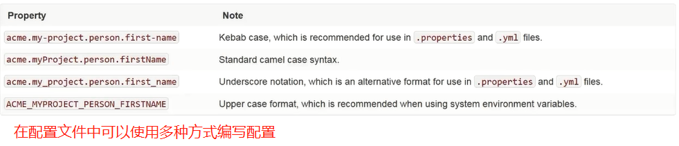
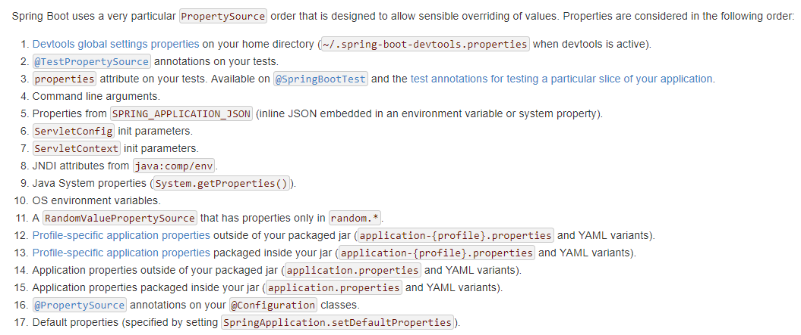

# 超越外部化配置

## 理解外部化配置

通常，对于可扩展性应用，尤其是中间件，它们的功能性组件是可配置的，如：认证信息、端口范围、线程池规模以及连接时间等。假设需要设置Spring应用的Profile为"dev"，可通过调用Spring ConfigurableEnvironment的setActiveProfiles("dev")方法实现。这种方式是一种显示地代码配置，配
置数据来源应用内部实现，所以称之为"内部化配置"。"内部化配置"虽能达成目的，然而配置行为是可以枚举的，必然缺少相应的弹性。


## 应用外部化配置

### Spring Boot官方说明应用场景

- Bean的@Value注入
- Spring Environment读取
- @ConfugurationProperties 绑定到结构化对象

### 外部化配置实际应用场景

#### 用于XML Bean定义的属性占位符

 可以使用@ImportResource注解加载xml配置文件

#### 用于@Value注入


#### 用于Environment读取

Environment是Spring API的一部分，3.1版本就开始支持。Environment扩展了PropertyResolver接口。

##### 获取Environment 


###### Environment方法/构造器依赖注入

利用@Bean标注的方法的参数为Environment，Spring会自动将Environment进行注入

```java
// 方法依赖注入

@Bean
@Autowired // 可加可不加
public User user(Environment environment){
     // 获取属性值，没有就会报错
	environment.getRequiredProperty("key",Class类型);
	 // 获取属性值，没有就返回空
	environment.getProperty("key",Class类型);
	// 获取属性值，可以设置默认值，当属性值为空时生效
	environment.getProperty("key",Class类型,默认值); 
}
```

```java
// 构造依赖注入

private final Environment environment;

@Autowired // 可加可不加
public XXXClass(Environment environment){
   this.environment = environment;
}

```


###### Environment @Autowired 依赖注入

```java
@Autowired
private Environment environment;
```


###### EnvironmentAware 接口回调

```java
@Component
public class XXXClass implements EnvironmentAware {

    @Override
    public void setEnvironment(Environment environment) {
         // ...
    }
}
```

###### BeanFactory依赖查找Environment

```java
@Component
 public class Application implements BeanFactoryAware {

    @Override
    public void setBeanFactory(BeanFactory beanFactory) throws BeansException {
        Environment environment = beanFactory.getBean(Environment.class);
    }
}
```

#### 用于@ConfigurationProperties Bean绑定

注意：进行属性绑定时，一定要写类中属性的setter方法，否则绑定不成功。

##### @ConfigurationProperties类级别标注

*配置文件 application.properties*

```json
user.id=1
user.name=gentryhuang
user.age=18
```
**@ConfigurationProperties 标注的类**
```java
package com.imooc.diveinspringboot.domain;

import org.springframework.boot.context.properties.ConfigurationProperties;

/**
 * 注意：使用ConfigurationProperties进行属性绑定时，必须实现对象中属性的setter方法，否则无法完成绑定
 *
 * @author shunhua
 * @date 2019-10-26
 */
@ConfigurationProperties(prefix = "user")
public class User {

    private Long id;

    private String name;

    private Integer age;

    public void setId(Long id) {
        this.id = id;
    }

    public void setName(String name) {
        this.name = name;
    }

    public void setAge(Integer age) {
        this.age = age;
    }

    @Override
    public String toString() {
        return "User{" +
                "id=" + id +
                ", name='" + name + '\'' +
                ", age=" + age +
                '}';
    }
}
```

*使用绑定类*

```java
/**
 * 可以使用 @EnableConfigurationProperties注解激活指定属性绑定类（加了@ConfigurationProperties注解的类），把它交给Spring管理。
 * 一般常使用@Component注解把该绑定类交给Spring容器管理更常用些，不过在自动配置类编写时@EnableConfigurationProperties注解使用多些。
 *
 * @author shunhua
 * @date 2019-10-26
 */
@EnableAutoConfiguration
@EnableConfigurationProperties(User.class)
public class ApplicationPropertiesBootstrap {

   /*
    有了 @EnableConfigurationProperties(User.class)，就已经把User实例交给Spring了，不需要再做其他的配置。
    @Bean
    public User user() {
        return new User();
    }*/

    public static void main(String[] args) {
        ConfigurableApplicationContext context = new SpringApplicationBuilder(ApplicationPropertiesBootstrap.class)
                .web(WebApplicationType.NONE)
                .run(args);

        // 从Spring中取出User实例
        User user = context.getBean(User.class);
        System.out.println(user);
        // 关闭容器
        context.close();

    }
}
```

##### @ConfigurationProperties @Bean方法声明

注意：这种方法是在User类时第三方提供的，此时可以使用@ConfigurationProperties注解标注，并且还要把该类交给Spring管理。

```java
/**
 * 可以使用 @EnableConfigurationProperties注解激活指定属性绑定类（加了@ConfigurationProperties注解的类），把它交给Spring管理。
 * 一般常使用@Component注解把该绑定类交给Spring容器管理更常用些，不过在自动配置类编写时@EnableConfigurationProperties注解使用多些。
 *
 * @author shunhua
 * @date 2019-10-26
 */
@EnableAutoConfiguration
public class ApplicationPropertiesBootstrap {

    @Bean
    @ConfigurationProperties(prefix = "user")
    public User user() {
        return new User();
    }

    public static void main(String[] args) {
        ConfigurableApplicationContext context = new SpringApplicationBuilder(ApplicationPropertiesBootstrap.class)
                .web(WebApplicationType.NONE)
                .run(args);

        // 从Spring中取出User实例
        User user = context.getBean(User.class);
        System.out.println(user);
        // 关闭容器
        context.close();

    }
}
```

##### @ConfigurationProperties嵌套类型绑定

*配置文件 application.properties*
```json
user.id=1
user.name=gentryhuang
user.age=18

user.city.postCode=0001
user.city.name=China
```

*绑定类*
```java
/**
 * 注意：
 *  使用ConfigurationProperties进行属性绑定时，必须实现对象中属性的setter方法，否则无法完成绑定。即使是嵌套绑定，也是如此递归模式
 *
 * @author shunhua
 * @date 2019-10-26
 */
@ConfigurationProperties(prefix = "user")
public class User {

    private Long id;

    private String name;

    private Integer age;

    private City city;

    public static class City{

        private String postCode;

        private String name;

        public void setPostCode(String postCode) {
            this.postCode = postCode;
        }

        public void setName(String name) {
            this.name = name;
        }

        @Override
        public String toString() {
            return "City{" +
                    "postCode='" + postCode + '\'' +
                    ", name='" + name + '\'' +
                    '}';
        }
    }

    public void setCity(City city) {
        this.city = city;
    }

    public void setId(Long id) {
        this.id = id;
    }

    public void setName(String name) {
        this.name = name;
    }

    public void setAge(Integer age) {
        this.age = age;
    }

    @Override
    public String toString() {
        return "User{" +
                "id=" + id +
                ", name='" + name + '\'' +
                ", age=" + age +
                ", city=" + city +
                '}';
    }
}
```
*使用*
```java
/**
 * 可以使用 @EnableConfigurationProperties注解激活指定属性绑定类（加了@ConfigurationProperties注解的类），把它交给Spring管理。
 * 一般常使用@Component注解把该绑定类交给Spring容器管理更常用些，不过在自动配置类编写时@EnableConfigurationProperties注解使用多些。
 *
 * @author shunhua
 * @date 2019-10-26
 */
@EnableAutoConfiguration
@EnableConfigurationProperties(User.class)
public class ApplicationPropertiesBootstrap {

    /*@Bean
    @ConfigurationProperties(prefix = "user")
    public User user() {
        return new User();
    }*/

    public static void main(String[] args) {
        ConfigurableApplicationContext context = new SpringApplicationBuilder(ApplicationPropertiesBootstrap.class)
                .web(WebApplicationType.NONE)
                .run(args);

        // 从Spring中取出User实例
        User user = context.getBean(User.class);
        System.out.println(user);
        context.close();
    }
}
```

##### 松散绑定




#### 用于@ConditionalOnProperty判断

```java
/**
 * 可以使用 @EnableConfigurationProperties注解激活指定属性绑定类（加了@ConfigurationProperties注解的类），把它交给Spring管理。
 * 一般常使用@Component注解把该绑定类交给Spring容器管理更常用些，不过在自动配置类编写时@EnableConfigurationProperties注解使用多些。
 *
 * @author shunhua
 * @date 2019-10-26
 */
@EnableAutoConfiguration
public class ApplicationPropertiesBootstrap {

    /**
     *  @ConditionalOnProperty指定的条件满足时才会装配UserBean，否则不会装配User Bean
     *    - name/value：指定属性名
     *    - matchIfMissing: 没有指定的属性是否继续装配
     *    - havingValue: 指定属性值
     *    - prefix ： 指定属性的前缀,用于配合name/value，拼接成完整的属性名
     *
     * @return
     */
    @Bean
    @ConfigurationProperties(prefix = "user")
    @ConditionalOnProperty(name="city.name",matchIfMissing = false,prefix = "user",havingValue = "China")
    public User user() {
        return new User();
    }

    public static void main(String[] args) {
        ConfigurableApplicationContext context = new SpringApplicationBuilder(ApplicationPropertiesBootstrap.class)
                .web(WebApplicationType.NONE)
                .run(args);

        // 从Spring中取出User实例
        User user = context.getBean(User.class);
        System.out.println(user);

        context.close();

    }
}
```


## 扩展外部化配置


### 理解Spring Boot Environment生命周期

*原则*

扩展外部化配置属性源要在Environmen初始化前，即下面Spring Framework和Spring Boot注意项。否则上下文可能就应用不到最新变更的相关配置，
这也是扩展外部化配置的一个很重要点。

#### Spring Framework中

初始化环境，尽量在org.springframework.context.support.AbstractApplicationContext#prepareBeanFactory方法前，因为在该方法中会设置名称environment的Environment实例，后面的很多过程可能都需要使用到环境对象。因为环境对象只有一个。

```java

  // org.springframework.context.support.AbstractApplicationContext#prepareBeanFactory 方法

	/**
	 * Configure the factory's standard context characteristics,
	 * such as the context's ClassLoader and post-processors.
	 * @param beanFactory the BeanFactory to configure
	 */
	protected void prepareBeanFactory(ConfigurableListableBeanFactory beanFactory) {
		// Tell the internal bean factory to use the context's class loader etc.
		beanFactory.setBeanClassLoader(getClassLoader());
		beanFactory.setBeanExpressionResolver(new StandardBeanExpressionResolver(beanFactory.getBeanClassLoader()));
		beanFactory.addPropertyEditorRegistrar(new ResourceEditorRegistrar(this, getEnvironment()));

		// Configure the bean factory with context callbacks.
		beanFactory.addBeanPostProcessor(new ApplicationContextAwareProcessor(this));
		beanFactory.ignoreDependencyInterface(EnvironmentAware.class);
		beanFactory.ignoreDependencyInterface(EmbeddedValueResolverAware.class);
		beanFactory.ignoreDependencyInterface(ResourceLoaderAware.class);
		beanFactory.ignoreDependencyInterface(ApplicationEventPublisherAware.class);
		beanFactory.ignoreDependencyInterface(MessageSourceAware.class);
		beanFactory.ignoreDependencyInterface(ApplicationContextAware.class);

		// BeanFactory interface not registered as resolvable type in a plain factory.
		// MessageSource registered (and found for autowiring) as a bean.
		beanFactory.registerResolvableDependency(BeanFactory.class, beanFactory);
		beanFactory.registerResolvableDependency(ResourceLoader.class, this);
		beanFactory.registerResolvableDependency(ApplicationEventPublisher.class, this);
		beanFactory.registerResolvableDependency(ApplicationContext.class, this);

		// Register early post-processor for detecting inner beans as ApplicationListeners.
		beanFactory.addBeanPostProcessor(new ApplicationListenerDetector(this));

		// Detect a LoadTimeWeaver and prepare for weaving, if found.
		if (beanFactory.containsBean(LOAD_TIME_WEAVER_BEAN_NAME)) {
			beanFactory.addBeanPostProcessor(new LoadTimeWeaverAwareProcessor(beanFactory));
			// Set a temporary ClassLoader for type matching.
			beanFactory.setTempClassLoader(new ContextTypeMatchClassLoader(beanFactory.getBeanClassLoader()));
		}

		// Register default environment beans.
		if (!beanFactory.containsLocalBean(ENVIRONMENT_BEAN_NAME)) {
			// 设置名为environment的环境对象
			beanFactory.registerSingleton(ENVIRONMENT_BEAN_NAME, getEnvironment());
		}
		if (!beanFactory.containsLocalBean(SYSTEM_PROPERTIES_BEAN_NAME)) {
			beanFactory.registerSingleton(SYSTEM_PROPERTIES_BEAN_NAME, getEnvironment().getSystemProperties());
		}
		if (!beanFactory.containsLocalBean(SYSTEM_ENVIRONMENT_BEAN_NAME)) {
			beanFactory.registerSingleton(SYSTEM_ENVIRONMENT_BEAN_NAME, getEnvironment().getSystemEnvironment());
		}
	}
```

```java
	@Override
	public void refresh() throws BeansException, IllegalStateException {
		synchronized (this.startupShutdownMonitor) {
			// Prepare this context for refreshing.
			prepareRefresh();

			// Tell the subclass to refresh the internal bean factory.
			ConfigurableListableBeanFactory beanFactory = obtainFreshBeanFactory();

			// Prepare the bean factory for use in this context,同时设置了环境
			prepareBeanFactory(beanFactory);

            // 后面的会过程可能会用到环境实例
			try {
				// Allows post-processing of the bean factory in context subclasses.
				postProcessBeanFactory(beanFactory);

				// Invoke factory processors registered as beans in the context.
				invokeBeanFactoryPostProcessors(beanFactory);

				// Register bean processors that intercept bean creation.
				registerBeanPostProcessors(beanFactory);

				// Initialize message source for this context.
				initMessageSource();

				// Initialize event multicaster for this context.
				initApplicationEventMulticaster();

				// Initialize other special beans in specific context subclasses.
				onRefresh();

				// Check for listener beans and register them.
				registerListeners();

				// Instantiate all remaining (non-lazy-init) singletons.
				finishBeanFactoryInitialization(beanFactory);

				// Last step: publish corresponding event.
				finishRefresh();
			}

			catch (BeansException ex) {
				if (logger.isWarnEnabled()) {
					logger.warn("Exception encountered during context initialization - " +
							"cancelling refresh attempt: " + ex);
				}

				// Destroy already created singletons to avoid dangling resources.
				destroyBeans();

				// Reset 'active' flag.
				cancelRefresh(ex);

				// Propagate exception to caller.
				throw ex;
			}

			finally {
				// Reset common introspection caches in Spring's core, since we
				// might not ever need metadata for singleton beans anymore...
				resetCommonCaches();
			}
		}
	}
```

#### Spring Boot中

Environment初始化尽量在org.springframework.boot.SpringApplication#refreshContext方法前初始化

```java
public ConfigurableApplicationContext run(String... args) {
		StopWatch stopWatch = new StopWatch();
		stopWatch.start();
		ConfigurableApplicationContext context = null;
		Collection<SpringBootExceptionReporter> exceptionReporters = new ArrayList<>();
		configureHeadlessProperty();
		SpringApplicationRunListeners listeners = getRunListeners(args);
		listeners.starting();
		try {
			ApplicationArguments applicationArguments = new DefaultApplicationArguments(
					args);
			ConfigurableEnvironment environment = prepareEnvironment(listeners,
					applicationArguments);
			configureIgnoreBeanInfo(environment);
			Banner printedBanner = printBanner(environment);
			context = createApplicationContext();
			exceptionReporters = getSpringFactoriesInstances(
					SpringBootExceptionReporter.class,
					new Class[] { ConfigurableApplicationContext.class }, context);
			prepareContext(context, environment, listeners, applicationArguments,
					printedBanner);
			// 该方法内部会调用Spring的refresh()方法
			refreshContext(context);
			afterRefresh(context, applicationArguments);
			stopWatch.stop();
			if (this.logStartupInfo) {
				new StartupInfoLogger(this.mainApplicationClass)
						.logStarted(getApplicationLog(), stopWatch);
			}
			listeners.started(context);
			callRunners(context, applicationArguments);
		}
		catch (Throwable ex) {
			handleRunFailure(context, ex, exceptionReporters, listeners);
			throw new IllegalStateException(ex);
		}

		try {
			listeners.running(context);
		}
		catch (Throwable ex) {
			handleRunFailure(context, ex, exceptionReporters, null);
			throw new IllegalStateException(ex);
		}
		return context;
	}
```


### 定位外部化配置属性源

Spring Boot使用多个特别的 PropertySource，来实现扩展配置。外部化配置针对以下可能的多种。



注意：
 在ConfigurableEnvironment中，可以通过getPropertySources方法获取MutablePropertySources对象，并且MutablePropertySources又实现了可以迭代的PropertySources接口,我们可以通过迭代输出PropertySource,观察当前环境下PropertySource情况。

```java
package org.springframework.core.env;

import org.springframework.lang.Nullable;

/**
 * Holder containing one or more {@link PropertySource} objects.
 *
 * @author Chris Beams
 * @since 3.1
 */
public interface PropertySources extends Iterable<PropertySource<?>> {

	/**
	 * Return whether a property source with the given name is contained.
	 * @param name the {@linkplain PropertySource#getName() name of the property source} to find
	 */
	boolean contains(String name);

	/**
	 * Return the property source with the given name, {@code null} if not found.
	 * @param name the {@linkplain PropertySource#getName() name of the property source} to find
	 */
	@Nullable
	PropertySource<?> get(String name);

}

```

```java
public abstract class PropertySource<T> {

	protected final Log logger = LogFactory.getLog(getClass());

	protected final String name;

	protected final T source;


	/**
	 * Create a new {@code PropertySource} with the given name and source object.
	 */
	public PropertySource(String name, T source) {
		Assert.hasText(name, "Property source name must contain at least one character");
		Assert.notNull(source, "Property source must not be null");
		this.name = name;
		this.source = source;
	}

	/**
	 * Create a new {@code PropertySource} with the given name and with a new
	 * {@code Object} instance as the underlying source.
	 * <p>Often useful in testing scenarios when creating anonymous implementations
	 * that never query an actual source but rather return hard-coded values.
	 */
	@SuppressWarnings("unchecked")
	public PropertySource(String name) {
		this(name, (T) new Object());
	}


	/**
	 * Return the name of this {@code PropertySource}
	 */
	public String getName() {
		return this.name;
	}

	/**
	 * Return the underlying source object for this {@code PropertySource}.
	 */
	public T getSource() {
		return this.source;
	}

	/**
	 * Return whether this {@code PropertySource} contains the given name.
	 * <p>This implementation simply checks for a {@code null} return value
	 * from {@link #getProperty(String)}. Subclasses may wish to implement
	 * a more efficient algorithm if possible.
	 * @param name the property name to find
	 */
	public boolean containsProperty(String name) {
		return (getProperty(name) != null);
	}

	/**
	 * Return the value associated with the given name,
	 * or {@code null} if not found.
	 * @param name the property to find
	 * @see PropertyResolver#getRequiredProperty(String)
	 */
	@Nullable
	public abstract Object getProperty(String name);


	/**
	 * This {@code PropertySource} object is equal to the given object if:
	 * <ul>
	 * <li>they are the same instance
	 * <li>the {@code name} properties for both objects are equal
	 * </ul>
	 * <p>No properties other than {@code name} are evaluated.
	 */
	@Override
	public boolean equals(Object obj) {
		return (this == obj || (obj instanceof PropertySource &&
				ObjectUtils.nullSafeEquals(this.name, ((PropertySource<?>) obj).name)));
	}

	/**
	 * Return a hash code derived from the {@code name} property
	 * of this {@code PropertySource} object.
	 */
	@Override
	public int hashCode() {
		return ObjectUtils.nullSafeHashCode(this.name);
	}

	/**
	 * Produce concise output (type and name) if the current log level does not include
	 * debug. If debug is enabled, produce verbose output including the hash code of the
	 * PropertySource instance and every name/value property pair.
	 * <p>This variable verbosity is useful as a property source such as system properties
	 * or environment variables may contain an arbitrary number of property pairs,
	 * potentially leading to difficult to read exception and log messages.
	 * @see Log#isDebugEnabled()
	 */
	@Override
	public String toString() {
		if (logger.isDebugEnabled()) {
			return getClass().getSimpleName() + "@" + System.identityHashCode(this) +
					" {name='" + this.name + "', properties=" + this.source + "}";
		}
		else {
			return getClass().getSimpleName() + " {name='" + this.name + "'}";
		}
	}


	/**
	 * Return a {@code PropertySource} implementation intended for collection comparison purposes only.
	 * <p>Primarily for internal use, but given a collection of {@code PropertySource} objects, may be
	 * used as follows:
	 * <pre class="code">
	 * {@code List<PropertySource<?>> sources = new ArrayList<PropertySource<?>>();
	 * sources.add(new MapPropertySource("sourceA", mapA));
	 * sources.add(new MapPropertySource("sourceB", mapB));
	 * assert sources.contains(PropertySource.named("sourceA"));
	 * assert sources.contains(PropertySource.named("sourceB"));
	 * assert !sources.contains(PropertySource.named("sourceC"));
	 * }</pre>
	 * The returned {@code PropertySource} will throw {@code UnsupportedOperationException}
	 * if any methods other than {@code equals(Object)}, {@code hashCode()}, and {@code toString()}
	 * are called.
	 * @param name the name of the comparison {@code PropertySource} to be created and returned.
	 */
	public static PropertySource<?> named(String name) {
		return new ComparisonPropertySource(name);
	}


	/**
	 * {@code PropertySource} to be used as a placeholder in cases where an actual
	 * property source cannot be eagerly initialized at application context
	 * creation time.  For example, a {@code ServletContext}-based property source
	 * must wait until the {@code ServletContext} object is available to its enclosing
	 * {@code ApplicationContext}.  In such cases, a stub should be used to hold the
	 * intended default position/order of the property source, then be replaced
	 * during context refresh.
	 * @see org.springframework.context.support.AbstractApplicationContext#initPropertySources()
	 * @see org.springframework.web.context.support.StandardServletEnvironment
	 * @see org.springframework.web.context.support.ServletContextPropertySource
	 */
	public static class StubPropertySource extends PropertySource<Object> {

		public StubPropertySource(String name) {
			super(name, new Object());
		}

		/**
		 * Always returns {@code null}.
		 */
		@Override
		@Nullable
		public String getProperty(String name) {
			return null;
		}
	}


	/**
	 * @see PropertySource#named(String)
	 */
	static class ComparisonPropertySource extends StubPropertySource {

		private static final String USAGE_ERROR =
				"ComparisonPropertySource instances are for use with collection comparison only";

		public ComparisonPropertySource(String name) {
			super(name);
		}

		@Override
		public Object getSource() {
			throw new UnsupportedOperationException(USAGE_ERROR);
		}

		@Override
		public boolean containsProperty(String name) {
			throw new UnsupportedOperationException(USAGE_ERROR);
		}

		@Override
		@Nullable
		public String getProperty(String name) {
			throw new UnsupportedOperationException(USAGE_ERROR);
		}
	}

}
```

```java
public interface ConfigurableEnvironment extends Environment, ConfigurablePropertyResolver {

	/**
	 * Specify the set of profiles active for this {@code Environment}. Profiles are
	 * evaluated during container bootstrap to determine whether bean definitions
	 * should be registered with the container.
	 * <p>Any existing active profiles will be replaced with the given arguments; call
	 * with zero arguments to clear the current set of active profiles. Use
	 * {@link #addActiveProfile} to add a profile while preserving the existing set.
	 * @see #addActiveProfile
	 * @see #setDefaultProfiles
	 * @see org.springframework.context.annotation.Profile
	 * @see AbstractEnvironment#ACTIVE_PROFILES_PROPERTY_NAME
	 * @throws IllegalArgumentException if any profile is null, empty or whitespace-only
	 */
	void setActiveProfiles(String... profiles);

	/**
	 * Add a profile to the current set of active profiles.
	 * @see #setActiveProfiles
	 * @throws IllegalArgumentException if the profile is null, empty or whitespace-only
	 */
	void addActiveProfile(String profile);

	/**
	 * Specify the set of profiles to be made active by default if no other profiles
	 * are explicitly made active through {@link #setActiveProfiles}.
	 * @see AbstractEnvironment#DEFAULT_PROFILES_PROPERTY_NAME
	 * @throws IllegalArgumentException if any profile is null, empty or whitespace-only
	 */
	void setDefaultProfiles(String... profiles);

	/**
	 * Return the {@link PropertySources} for this {@code Environment} in mutable form,
	 * allowing for manipulation of the set of {@link PropertySource} objects that should
	 * be searched when resolving properties against this {@code Environment} object.
	 * The various {@link MutablePropertySources} methods such as
	 * {@link MutablePropertySources#addFirst addFirst},
	 * {@link MutablePropertySources#addLast addLast},
	 * {@link MutablePropertySources#addBefore addBefore} and
	 * {@link MutablePropertySources#addAfter addAfter} allow for fine-grained control
	 * over property source ordering. This is useful, for example, in ensuring that
	 * certain user-defined property sources have search precedence over default property
	 * sources such as the set of system properties or the set of system environment
	 * variables.
	 * @see AbstractEnvironment#customizePropertySources
	 */
	MutablePropertySources getPropertySources();

	/**
	 * Return the value of {@link System#getenv()} if allowed by the current
	 * {@link SecurityManager}, otherwise return a map implementation that will attempt
	 * to access individual keys using calls to {@link System#getenv(String)}.
	 * <p>Note that most {@link Environment} implementations will include this system
	 * environment map as a default {@link PropertySource} to be searched. Therefore, it
	 * is recommended that this method not be used directly unless bypassing other
	 * property sources is expressly intended.
	 * <p>Calls to {@link Map#get(Object)} on the Map returned will never throw
	 * {@link IllegalAccessException}; in cases where the SecurityManager forbids access
	 * to a property, {@code null} will be returned and an INFO-level log message will be
	 * issued noting the exception.
	 */
	Map<String, Object> getSystemEnvironment();

	/**
	 * Return the value of {@link System#getProperties()} if allowed by the current
	 * {@link SecurityManager}, otherwise return a map implementation that will attempt
	 * to access individual keys using calls to {@link System#getProperty(String)}.
	 * <p>Note that most {@code Environment} implementations will include this system
	 * properties map as a default {@link PropertySource} to be searched. Therefore, it is
	 * recommended that this method not be used directly unless bypassing other property
	 * sources is expressly intended.
	 * <p>Calls to {@link Map#get(Object)} on the Map returned will never throw
	 * {@link IllegalAccessException}; in cases where the SecurityManager forbids access
	 * to a property, {@code null} will be returned and an INFO-level log message will be
	 * issued noting the exception.
	 */
	Map<String, Object> getSystemProperties();

	/**
	 * Append the given parent environment's active profiles, default profiles and
	 * property sources to this (child) environment's respective collections of each.
	 * <p>For any identically-named {@code PropertySource} instance existing in both
	 * parent and child, the child instance is to be preserved and the parent instance
	 * discarded. This has the effect of allowing overriding of property sources by the
	 * child as well as avoiding redundant searches through common property source types,
	 * e.g. system environment and system properties.
	 * <p>Active and default profile names are also filtered for duplicates, to avoid
	 * confusion and redundant storage.
	 * <p>The parent environment remains unmodified in any case. Note that any changes to
	 * the parent environment occurring after the call to {@code merge} will not be
	 * reflected in the child. Therefore, care should be taken to configure parent
	 * property sources and profile information prior to calling {@code merge}.
	 * @param parent the environment to merge with
	 * @since 3.1.2
	 * @see org.springframework.context.support.AbstractApplicationContext#setParent
	 */
	void merge(ConfigurableEnvironment parent);

}

```

##### 如何理解 PropertySource

 带有名称的属性源，如Properties文件、Map、YAML文件等，通过相关介质最终转换为Map


##### 如何理解Environment抽象

Envrionment与PropertySources是一对一，PropertySources与PropertySource是一对多。外部化配置是关联在Environment接口实现中的。
其中我们直接看到的是ConfigurableEnvironment与MutablePropertySources（是PropertySources子类）是一对一的。

#### 扩展方式

###### 基于SpringApplicationRunListener#environmentPrepared扩展外部化配置属性源

*spring.factories*

```text
org.springframework.boot.SpringApplicationRunListener=\
com.code.diveinspringboot.listener.ExtendPropertySourceRunListener
```

*实现类*

```java
/**
 * 扩展 {@link org.springframework.core.env.PropertySources}
 *
 * @author shunhua
 * @date 2019-10-26
 */
public class ExtendPropertySourceRunListener implements SpringApplicationRunListener, Ordered {

    private final SpringApplication application;

    private final String[] args;

    public ExtendPropertySourceRunListener(SpringApplication application, String[] args){
        this.application = application;
        this.args = args;
    }

    @Override
    public int getOrder() {
        return 1;
    }

    @Override
    public void environmentPrepared(ConfigurableEnvironment environment) {
        MutablePropertySources propertySources = environment.getPropertySources();

        Map<String ,Object> source = new HashMap<>(2);

        source.put("my_key","hello world");

        MapPropertySource mapPropertySource = new MapPropertySource("myName",source);

        propertySources.addFirst(mapPropertySource);

    }

    @Override
    public void starting() { }

    @Override
    public void contextPrepared(ConfigurableApplicationContext context) { }

    @Override
    public void contextLoaded(ConfigurableApplicationContext context) { }

    @Override
    public void started(ConfigurableApplicationContext context) { }

    @Override
    public void running(ConfigurableApplicationContext context) { }

    @Override
    public void failed(ConfigurableApplicationContext context, Throwable exception) { }
}
```

*启动类*

```java
import org.springframework.boot.WebApplicationType;
import org.springframework.boot.autoconfigure.EnableAutoConfiguration;
import org.springframework.boot.builder.SpringApplicationBuilder;
import org.springframework.context.ConfigurableApplicationContext;
import org.springframework.core.env.ConfigurableEnvironment;

/**
 * ExtendPropertySourceRunListenerApplication
 *
 * @author shunhua
 * @date 2019-10-26
 */
@EnableAutoConfiguration
public class ExtendPropertySourceRunListenerApplication {

    public static void main(String[] args) {
        ConfigurableApplicationContext context =
                new SpringApplicationBuilder(ExtendPropertySourceRunListenerApplication.class)
                .web(WebApplicationType.NONE)
                .properties("myproperty=10")
                .run(args);

        ConfigurableEnvironment environment = context.getEnvironment();

        /**
         * 打印当前环境中的PropertySource
         */
        environment.getPropertySources().forEach(propertySource ->{
            System.out.printf("PropertySource名称：%s : %s\n",propertySource.getName(),propertySource);
        });
    }
}
```


###### 基于ApplicationEnvironmentPreparedEvent事件扩展外部化配置属性源

*spring.factories*
```text
# Run Listeners
org.springframework.boot.SpringApplicationRunListener=\
com.imooc.diveinspringboot.listener.ExtendPropertySourceRunListener

# Event Listeners
org.springframework.context.ApplicationListener=\
com.imooc.diveinspringboot.listener.ExtendPropertySourceEventListener  

```

*事件监听*

```java
package com.imooc.diveinspringboot.listener;

import org.springframework.boot.context.event.ApplicationEnvironmentPreparedEvent;
import org.springframework.context.ApplicationListener;
import org.springframework.core.env.ConfigurableEnvironment;

/**
 * 扩展{@link org.springframework.core.env.PropertySources}实现，监听{@link ApplicationEnvironmentPreparedEvent}
 *
 * @author shunhua
 * @date 2019-10-26
 */
public class ExtendPropertySourceEventListener implements ApplicationListener<ApplicationEnvironmentPreparedEvent> {

    @Override
    public void onApplicationEvent(ApplicationEnvironmentPreparedEvent event) {
        ConfigurableEnvironment environment = event.getEnvironment();

        MutablePropertySources propertySources = environment.getPropertySources();

        Map<String ,Object> source = new HashMap<>(2);

        source.put("onApplicationEvent_key","onApplicationEvent");

        MapPropertySource mapPropertySource = new MapPropertySource("onApplicationEvent_property",source);

        propertySources.addFirst(mapPropertySource);


        /**
         * 打印当前环境中的PropertySource
         */
        environment.getPropertySources().forEach(propertySource ->{
            System.out.printf("PropertySource名称：%s : %s\n",propertySource.getName(),propertySource);
        });
    }
}
```

###### 基于EnvironmentPostProcessor扩展外部化配置属性源

EnvironmentPostProcessor的实现类ConfigFileApplicationListener，它里面定义了默认的外部化配置文件的路径以及名称

```java
public class ConfigFileApplicationListener
		implements EnvironmentPostProcessor, SmartApplicationListener, Ordered {

	private static final String DEFAULT_PROPERTIES = "defaultProperties";

	// 核心配置文件寻址的方式，如：application配置文件不仅可以放在resources下，还可以放在resourxes/config下
	private static final String DEFAULT_SEARCH_LOCATIONS = "classpath:/,classpath:/config/,file:./,file:./config/";

	private static final String DEFAULT_NAMES = "application";

	private static final Set<String> NO_SEARCH_NAMES = Collections.singleton(null);

	/**
	 * The "active profiles" property name.
	 */
	public static final String ACTIVE_PROFILES_PROPERTY = "spring.profiles.active";

	/**
	 * The "includes profiles" property name.
	 */
	public static final String INCLUDE_PROFILES_PROPERTY = "spring.profiles.include";

	/**
	 * The "config name" property name.
	 */
	public static final String CONFIG_NAME_PROPERTY = "spring.config.name";

	/**
	 * The "config location" property name.
	 */
	public static final String CONFIG_LOCATION_PROPERTY = "spring.config.location";

	/**
	 * The "config additional location" property name.
	 */
	public static final String CONFIG_ADDITIONAL_LOCATION_PROPERTY = "spring.config.additional-location";

	/**
	 * The default order for the processor.
	 */
	public static final int DEFAULT_ORDER = Ordered.HIGHEST_PRECEDENCE + 10;

	/**
	 * Name of the application configuration {@link PropertySource}.
	 */
	public static final String APPLICATION_CONFIGURATION_PROPERTY_SOURCE_NAME = "applicationConfigurationProperties";

	private final DeferredLog logger = new DeferredLog();

	private String searchLocations;

	private String names;

	private int order = DEFAULT_ORDER;

	// ...
}
```

*spring.factories*

```text
# Run Listeners
org.springframework.boot.SpringApplicationRunListener=\
com.imooc.diveinspringboot.listener.ExtendPropertySourceRunListener

# Event Listeners
org.springframework.context.ApplicationListener=\
com.imooc.diveinspringboot.listener.ExtendPropertySourceEventListener  

# Environment Post Processors
org.springframework.boot.env.EnvironmentPostProcessor=\
com.imooc.diveinspringboot.processor.ExtendPropertySourcesEnvironmentPostProcessor  
```

*EnvironmentPostProcessor扩展实现*

```java
package com.imooc.diveinspringboot.processor;

import org.springframework.boot.SpringApplication;
import org.springframework.boot.env.EnvironmentPostProcessor;
import org.springframework.core.env.ConfigurableEnvironment;

/**
 * 扩展{@link org.springframework.core.env.PropertySources} 实现
 *
 * @author shunhua
 * @date 2019-10-26
 */
public class ExtendPropertySourcesEnvironmentPostProcessor implements EnvironmentPostProcessor {

    @Override
    public void postProcessEnvironment(ConfigurableEnvironment environment, SpringApplication application) {


        MutablePropertySources propertySources = environment.getPropertySources();

        Map<String ,Object> source = new HashMap<>(2);

        source.put("postProcessEnvironment_key","postProcessEnvironment");

        MapPropertySource mapPropertySource = new MapPropertySource("postProcessEnvironment_property",source);

        propertySources.addFirst(mapPropertySource);

        /**
         * 打印当前环境中的PropertySource
         */
        environment.getPropertySources().forEach(propertySource ->{
            System.out.printf("PropertySource名称：%s : %s\n",propertySource.getName(),propertySource);
        });
    }
}
```

###### 基于ApplicationContextInitializer扩展外部化配置属性源

*spring.factories*

```text
# Run Listeners
org.springframework.boot.SpringApplicationRunListener=\
com.imooc.diveinspringboot.listener.ExtendPropertySourceRunListener

# Event Listeners
org.springframework.context.ApplicationListener=\
com.imooc.diveinspringboot.listener.ExtendPropertySourceEventListener  

# Environment Post Processors
org.springframework.boot.env.EnvironmentPostProcessor=\
com.imooc.diveinspringboot.processor.ExtendPropertySourcesEnvironmentPostProcessor  

#ApplicationContextInitializer
org.springframework.context.ApplicationContextInitializer=\
com.imooc.diveinspringboot.initializer.ExtendPropertySourceApplicationContextInitializer  

```

*ApplicationContextInitializer实现*

```java
package com.imooc.diveinspringboot.initializer;

import org.springframework.context.ApplicationContextInitializer;
import org.springframework.context.ConfigurableApplicationContext;
import org.springframework.core.env.ConfigurableEnvironment;

/**
 * 扩展{@link org.springframework.core.env.PropertySources}
 *
 * @author shunhua
 * @date 2019-10-26
 */
public class ExtendPropertySourceApplicationContextInitializer implements ApplicationContextInitializer {

    @Override
    public void initialize(ConfigurableApplicationContext applicationContext) {

        ConfigurableEnvironment environment = applicationContext.getEnvironment();

        MutablePropertySources propertySources = environment.getPropertySources();

        Map<String ,Object> source = new HashMap<>(2);

        source.put("initialize_key","initialize");

        MapPropertySource mapPropertySource = new MapPropertySource("initialize_property",source);

        propertySources.addFirst(mapPropertySource);

          /**
         * 打印当前环境中的PropertySource
         */
        environment.getPropertySources().forEach(propertySource ->{
            System.out.printf("PropertySource名称：%s : %s\n",propertySource.getName(),propertySource);
        });
    }
}
```


###### 基于SpringApplicationRunListener#contextPrepared扩展外部化配置属性源

*spring.factories*

```text
# Run Listeners
org.springframework.boot.SpringApplicationRunListener=\
com.imooc.diveinspringboot.listener.ExtendPropertySourceRunListener

# Event Listeners
org.springframework.context.ApplicationListener=\
com.imooc.diveinspringboot.listener.ExtendPropertySourceEventListener  

# Environment Post Processors
org.springframework.boot.env.EnvironmentPostProcessor=\
com.imooc.diveinspringboot.processor.ExtendPropertySourcesEnvironmentPostProcessor  

#ApplicationContextInitializer
org.springframework.context.ApplicationContextInitializer=\
com.imooc.diveinspringboot.initializer.ExtendPropertySourceApplicationContextInitializer  

```

*contextPrepared扩展*

```java
package com.imooc.diveinspringboot.listener;

import org.springframework.boot.SpringApplication;
import org.springframework.boot.SpringApplicationRunListener;
import org.springframework.context.ConfigurableApplicationContext;
import org.springframework.core.Ordered;
import org.springframework.core.env.ConfigurableEnvironment;
import org.springframework.core.env.MapPropertySource;
import org.springframework.core.env.MutablePropertySources;

import java.util.HashMap;
import java.util.Map;

/**
 * 扩展 {@link org.springframework.core.env.PropertySources}
 *
 * @author shunhua
 * @date 2019-10-26
 */
public class ExtendPropertySourceRunListener implements SpringApplicationRunListener, Ordered {

    private final SpringApplication application;

    private final String[] args;

    public ExtendPropertySourceRunListener(SpringApplication application, String[] args){
        this.application = application;
        this.args = args;
    }

    @Override
    public int getOrder() {
        return 1;
    }

    @Override
    public void environmentPrepared(ConfigurableEnvironment environment) {
        MutablePropertySources propertySources = environment.getPropertySources();

        Map<String ,Object> source = new HashMap<>(2);

        source.put("environmentPrepared_key","environmentPrepared");

        MapPropertySource mapPropertySource = new MapPropertySource("environmentPrepared_property",source);

        propertySources.addFirst(mapPropertySource);

          /**
         * 打印当前环境中的PropertySource
         */
        environment.getPropertySources().forEach(propertySource ->{
            System.out.printf("PropertySource名称：%s : %s\n",propertySource.getName(),propertySource);
        });

    }

    @Override
    public void starting() {

    }

    @Override
    public void contextPrepared(ConfigurableApplicationContext context) {

        ConfigurableEnvironment environment = context.getEnvironment();

        MutablePropertySources propertySources = environment.getPropertySources();

        Map<String,Object> source = new HashMap();

        source.put("contextPrepared_key","contextPrepared");

        MapPropertySource propertySource = new MapPropertySource("contextPrepared_property",source);

        propertySources.addFirst(propertySource);

        /**
         * 打印当前环境中的PropertySource
         */
        environment.getPropertySources().forEach(propertySource ->{
            System.out.printf("PropertySource名称：%s : %s\n",propertySource.getName(),propertySource);
        });
    }

    @Override
    public void contextLoaded(ConfigurableApplicationContext context) {

    }

    @Override
    public void started(ConfigurableApplicationContext context) {

    }

    @Override
    public void running(ConfigurableApplicationContext context) {

    }

    @Override
    public void failed(ConfigurableApplicationContext context, Throwable exception) {

    }
}
```
###### 基于SpringApplicationRunListener#contextLoaded扩展外部化配置属性源

用法同上


###### 基于ApplicationPreparedEvent扩展外部化配置属性源

同样使用ApplicationListener进行监听

###### 注意点

如果要想保证自定义的PropertySouorce是最高优先级的，尽可能在调用时机靠后的阶段设置。


