## 从Zookeeper认知到手写分布式配置中心

## 简介

Apache Zookeeper提供了一种集中式信息存储服务，可以看做是一个数据库。

## 特点

数据存在内存中，类似文件系统的树形结构(文件和目录)，高吞吐量和低延迟，集群高可靠。ZK本质上是一个非关系型数据库，以key-value形式存储数据。树形中的每一个结构在ZK中称作节点(znode)，节点就对应着key，节点的值就对应着value。而每一个节点下还可以有子节点。注意，子节点和节点值是不同的东西。

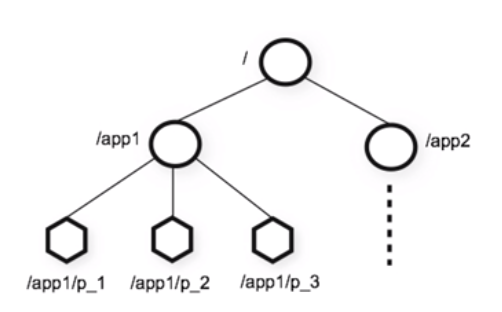

## 作用

基于Zookeeper可以实现分布式统一配置中心、服务注册中心、分布式锁等功能。


## 安装zookeeper

zookeeper依赖jdk

## Zookeeper命令

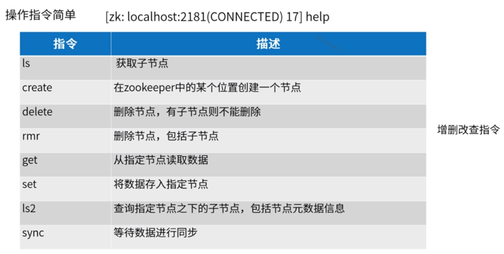

## Znode构成

```text
1 节点数据：存储的协调数据(状态信息、配置、位置信息等)
2 节点元数据(stat结构)
3 数据大小上限为1M
```

### 元数据信息

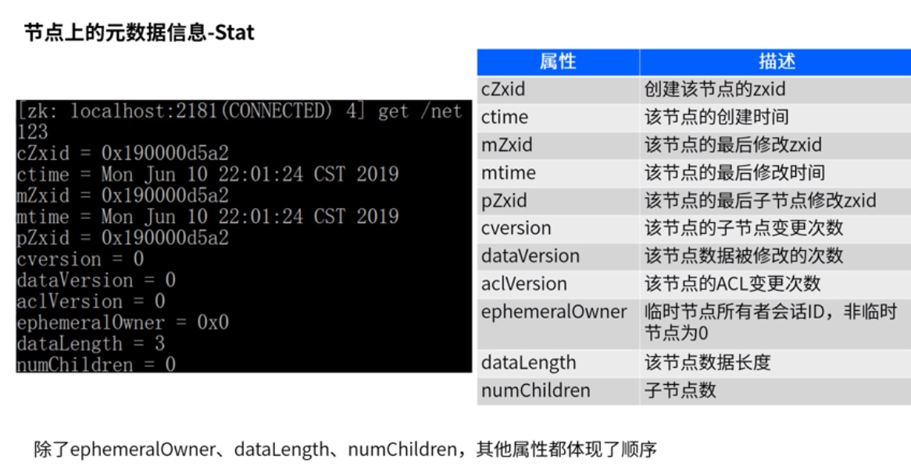

### 节点类型

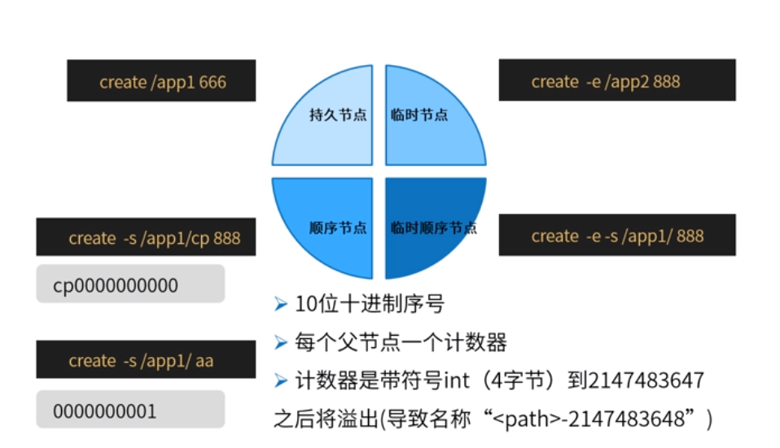

## Session会话

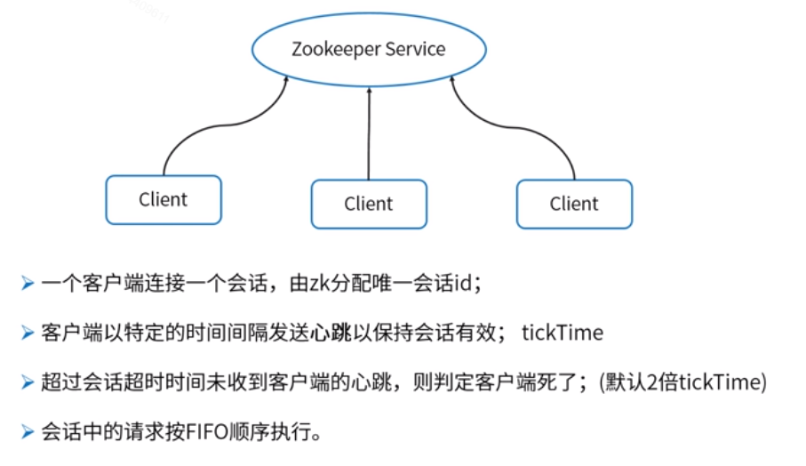

## ZK配置中心应用

### 何为配置中心

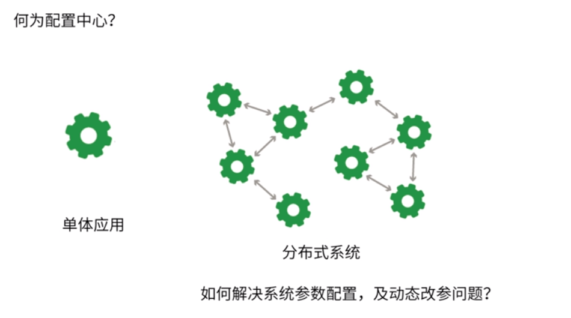

### 配置中心更新流程

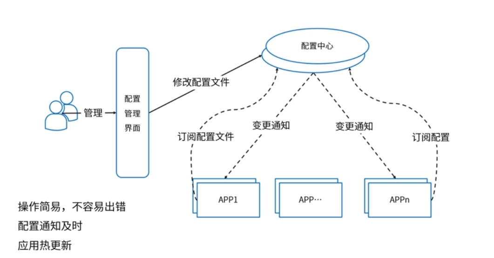

### 配置中心设计实现

#### ZK的Java Client

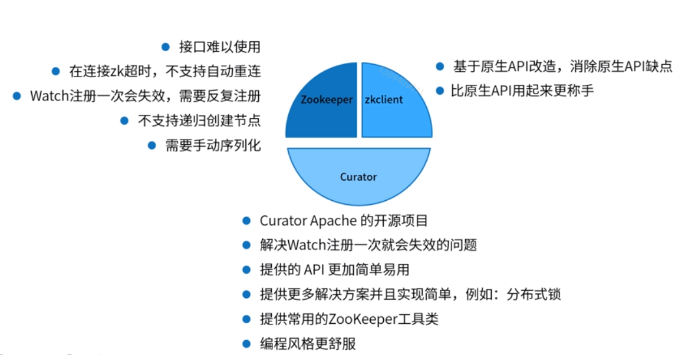

### 使用zk实现配置中心

#### Watch机制

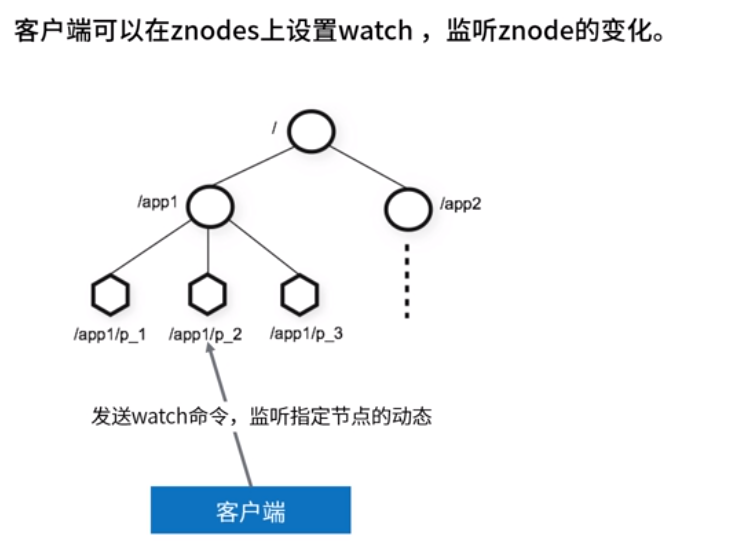

*两类watch*

```text
1 data watch 监听数据变更
2 child watch 监听子节点变化
```

*触发watch事件*

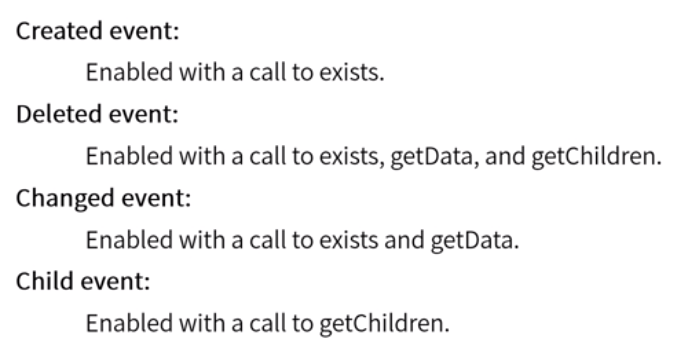

*watch重要特点*

```text
1 一次性触发：watch触发后即被删除。要持续监控变化，则需要持续设置watch。
2 有序性：客户端先得到watch通知，后才会看到变化结果
```

*watch注意事项*

```text
1 watch是一次性触发器，如果获得了一个watch监听的事件，并且希望继续得到关于未来更改的通知，则必须设置另一个watch。
2 watch是一次性触发器，并且在获取通知和再次发送watch注册新请求之间存在延迟，所以不能可靠地得到节点发生的每个更改。可能更改了两次，只监听到一次改变，因为第二个watch的注册发生在第二个改变后。
```

### ZK配置中心操作

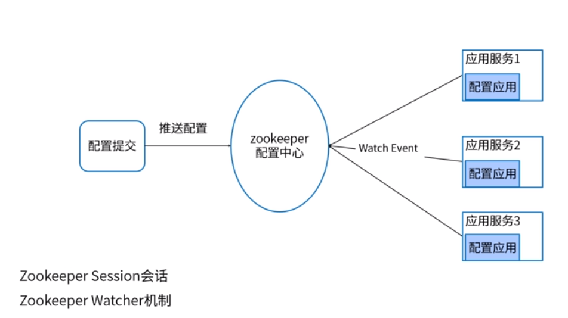

### ZK结构选择


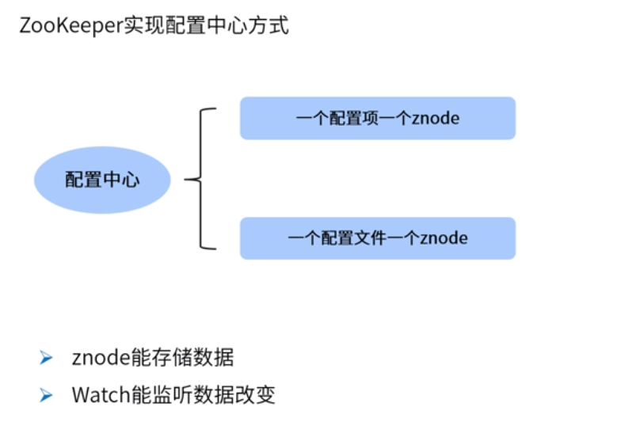

### ZK实现配置中心需求

模拟一个配置文件下有多个配置项节点，每个配置项节点带有对应的值。

## Zookeeper特点-有序

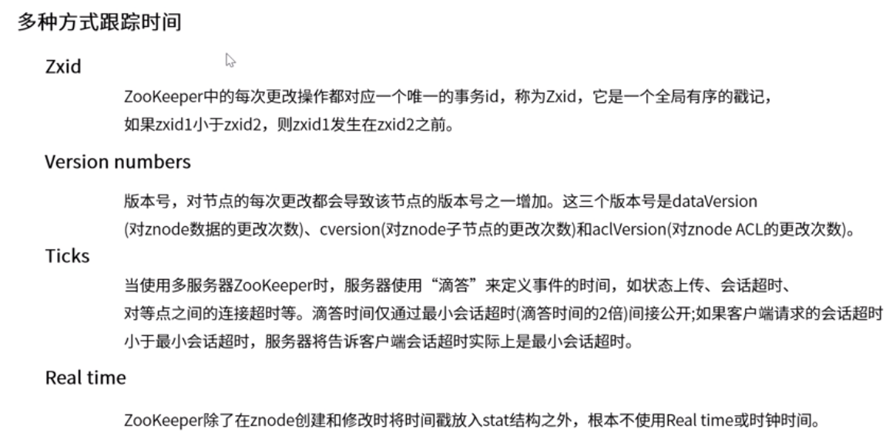


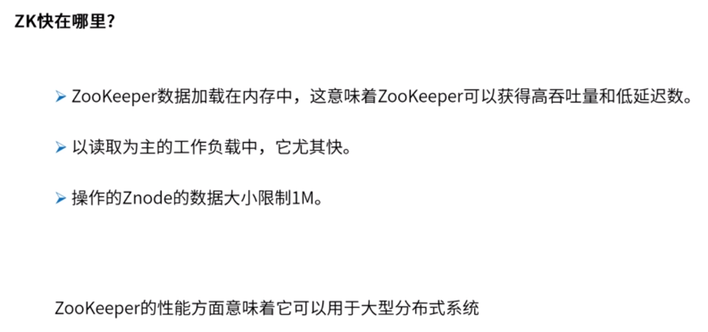

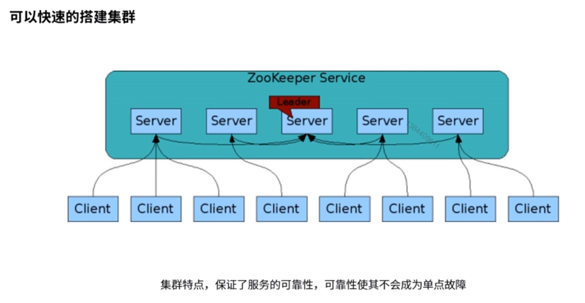

### Zookeeper分布式协调指挥官

```text
1. 顺序一致性，保证客户端操作是按顺序生效的
2. 原子性，更新成功或失败，没有部分结果
3. 单个系统映像，无论连接到哪个服务器，客户端都将得到相同的内容
4. 可靠性，数据的变更不会丢失，除非被客户端覆盖修改
5. 及时性，保证系统的客户端当时读取到的数据时最新的
```

